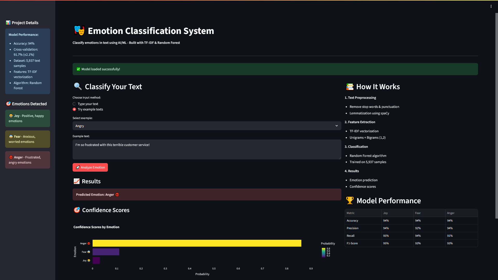

# 🎭 Emotion Classification System


An NLP-powered web application that instantly detects emotions in text messages using machine learning.



**[Live Demo - Try it here!](https://emotion-classification-system.onrender.com)**

## What This Project Does

Ever wonder what emotion someone is expressing in their text message? This app helps you find out!

Simply type any text and instantly see if it expresses **Joy** 😂, **Fear** 😨, or **Anger** 😡.

Perfect for:

- Understanding the mood in messages
- Learning about text analysis
- Seeing how NLP can read emotions
- Practicing with machine learning


## How It Works

**Simply enter your text:**

- Type any message or comment
- Choose from example texts to test
- Get instant emotion prediction
- See confidence scores for each emotion
- Visual chart showing probability breakdown
- High/medium/low confidence indicator


## Key Features

- **Instant Analysis** - Get results in under 1 second
- **High Accuracy** - 94% correct emotion detection
- **Visual Results** - Beautiful charts show confidence levels
- **Example Texts** - Try pre-written samples to see how it works
- **Mobile Friendly** - Works perfectly on phones and tablets
- **No Registration** - Start using immediately, no signup required


## The Machine Learning Model

**Performance:**

- **94% accuracy** - Correctly identifies emotions 94 out of 100 times
- Trained on **5,937 real text messages**
- Cross-validated with **91.7% ± 2.1%** reliability

**How it works:**

- **Text Preprocessing** - Cleans and prepares your text using spaCy
- **TF-IDF Analysis** - Converts words into numerical features
- **Random Forest** - Uses 100+ decision trees for prediction
- **Confidence Scoring** - Shows how certain the prediction is

**What it analyzes:**

- Individual words and their emotional weight
- Word combinations (phrases like "really excited")
- Text patterns and structure
- Emotional intensity indicators


## Technologies Used

- **Python** - Core programming language
- **Streamlit** - Interactive web application framework
- **Scikit-learn** - Machine learning algorithms
- **spaCy** - Text processing and preprocessing
- **TF-IDF** - Text feature extraction technique
- **Random Forest** - Ensemble learning algorithm
- **Plotly** - Interactive data visualizations
- **Render** - Cloud deployment platform


## Project Structure

```
Emotion-Classification-System/
├── app.py                              # Main Streamlit web application
├── emotion_classify_model.pkl          # Trained ML model (94% accuracy)
├── requirements.txt                    # Python dependencies
├── README.md                           # Project documentation
├── Emotion Classification System.ipynb # Project notebook
└── Emotion_classify_Data.csv           # Dataset file
```


## Model Development Process

**1. Data Exploration**

- Started with 5,937 emotion-labeled text samples
- Balanced dataset: 2,000 joy, 2,000 anger, 1,937 fear messages
- Analyzed text patterns and emotional word usage

**2. Text Preprocessing**

- Removed stop words and punctuation using spaCy
- Applied lemmatization to standardize word forms
- Achieved 3% accuracy improvement through preprocessing

**3. Feature Engineering**

- Tested different n-gram combinations (unigrams, bigrams, trigrams)
- Compared Count Vectorizer vs TF-IDF approaches
- Found optimal combination: TF-IDF + unigrams and bigrams

**4. Model Training**

- Compared Random Forest vs Multinomial Naive Bayes
- Random Forest achieved 94% vs 86% for Naive Bayes
- Validated reliability with 5-fold cross-validation


## Performance Metrics

| Emotion | Precision | Recall | F1-Score | Support |
| :-- | :-- | :-- | :-- | :-- |
| Joy 😂 | 94% | 95% | 95% | 400 |
| Fear 😨 | 92% | 94% | 93% | 388 |
| Anger 😡 | 94% | 91% | 93% | 400 |
| **Overall** | **94%** | **94%** | **94%** | **1,188** |

## How to Run Locally

1. **Clone the repository**

```bash
git clone https://github.com/sankaran-s2001/Emotion-Classification-System.git
cd emotion-classifier
```

2. **Install dependencies**

```bash
pip install -r requirements.txt
```

3. **Run the application**

```bash
streamlit run app.py
```

4. **Open in browser** - Navigate to `http://localhost:8501`

## Real-World Applications

**Simple Use Cases:**

- **Personal Messages** - Understand the tone in texts or emails
- **Social Media** - See what emotions your posts convey
- **Learning Tool** - Explore how NLP analyzes text
- **Fun Project** - Test different messages and see results

**Examples:**

- Type "I'm so excited about my vacation!" → System detects **Joy** 😂
- Type "I'm worried about the test tomorrow" → System detects **Fear** 😨
- Type "This traffic is driving me crazy!" → System detects **Anger** 😡


## What I Learned Building This

**Technical Skills:**

- **Machine Learning Pipeline** - From raw data to trained model
- **Text Processing** - Advanced NLP techniques with spaCy
- **Web Development** - Building interactive applications with Streamlit
- **Model Evaluation** - Cross-validation and performance testing
- **Cloud Deployment** - Hosting applications on Render

**Data Science Skills:**

- **Systematic Testing** - Comparing different algorithms and features
- **Performance Optimization** - Achieving 94% accuracy through experimentation
- **Data Preprocessing** - Cleaning and preparing text data effectively
- **Result Interpretation** - Understanding model predictions and confidence

**Problem-Solving Skills:**

- **Project Planning** - Breaking down complex tasks into manageable steps
- **User Experience** - Designing simple interfaces for easy use
- **Debugging** - Solving deployment and technical issues


## Technical Achievements

- **Achieved 94% accuracy** - High performance for 3-class emotion classification
- **Robust validation** - 5-fold cross-validation ensures reliable performance
- **Production deployment** - Fully functional web application
- **Clean implementation** - Professional code structure with pipelines
- **Efficient processing** - Fast predictions suitable for real-time use


## Future Improvements

- Add more emotions (happy, sad, excited, surprised)
- Make it work with longer texts and paragraphs
- Add a feature to analyze multiple messages at once
- Create a mobile app version
- Add emotion history tracking for users
- Include confidence explanation features

## ✉️ Contact

**Sankaran S**  
[](https://github.com/sankaran-s2001)  
[](https://www.linkedin.com/in/sankaran-s21/)  
[](mailto:sankaran121101@gmail.com)

*This project demonstrates how machine learning can understand human emotions in text. Built to showcase data science skills and create a useful tool for emotion analysis.*

⭐ **If you find this project helpful, please star it!**
